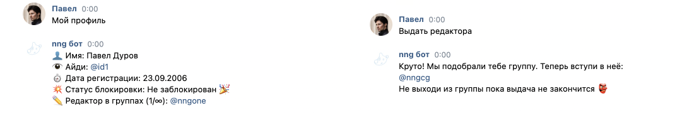

# nng bot

Чат-бот для групп nng, позволяющий пользователям подавать заявку на редактора и запрашивать разблокировку. Помимо этого так же предусмотрена админ-панель с возможностью просмотра статистики групп и рассмотрением запросов на разблокировку.

  

## Установка

Воспользуйтесь готовым [Docker-контейнером](https://github.com/orgs/MrAlonas/packages/container/package/nng-bot).

По умолчанию используется порт `1220`, поэтому необходимо использовать прокси-сервер (например nginx).

## Настройка

### Переменные среды

* `DataURL` — Ссылка на [общий список](https://github.com/MrAlonas/nng#datajson)
* `EditorGrantEnabled` **(true)** — Включена ли выдача редакторов
* `LogUser` — Айди страницы человека, которому будут отправляться логи
* `UserToken` — Токен страницы, от которой выполняются действия
* `DialogGroupId` — Айди группы
* `DialogGroupToken` — Токен группы
* `DialogGroupSecret` — Секретный ключ
* `DialogGroupConfirm` — Строка, которую должен вернуть сервер
* `UpdateAtStart` **(true)** — Обновлять ли кэш при запуске
* `UpdatePerHours` **(4)** — Интервал обновления кэша в часах
* `AdminUsers` — Айди администраторов
* `EditorRestriction` **(20)** — Максимальное количество редакторов на человека
* `GroupManagersCeiling` **(100)** — Максимальное количество редакторов в группах
