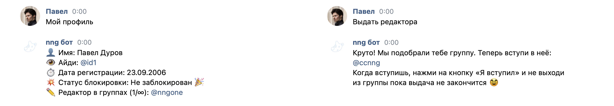

# nng bot

Чат-бот для групп nng, позволяющий пользователям подавать заявку на редактора и запрашивать разблокировку.

  

## Установка

Воспользуйтесь готовым [Docker-контейнером](https://github.com/orgs/MrAlonas/packages/container/package/nng-bot).

По умолчанию используется порт `1220`, поэтому необходимо использовать прокси-сервер (например nginx).

## Настройка

### Переменные среды

* `REDIS_URL` — Ссылка на базу данных
